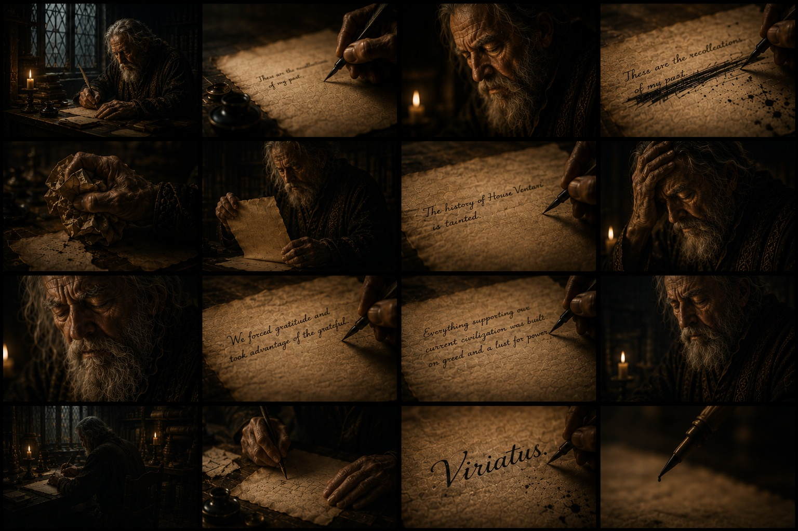

← [Back to Founding Era](../README.md) | ← [The Marriage That Became War](./Chapter_05_Marriage_That_Became_War.md) | [What I Saw Isn't What I See →](./Chapter_07_What_I_Saw_Isnt_What_I_See.md)

---

# Chapter Six: The Mountain

The last time I saw Teresta, we were by the well.

We were talking about universities. She didn't say where she was going. She knew me better than I knew myself.

"I'll miss you."

She glanced back at the house and left. I knew she wasn't expecting me to return the words, but even if there had been doubt, her stride erased it.

Father appeared.
